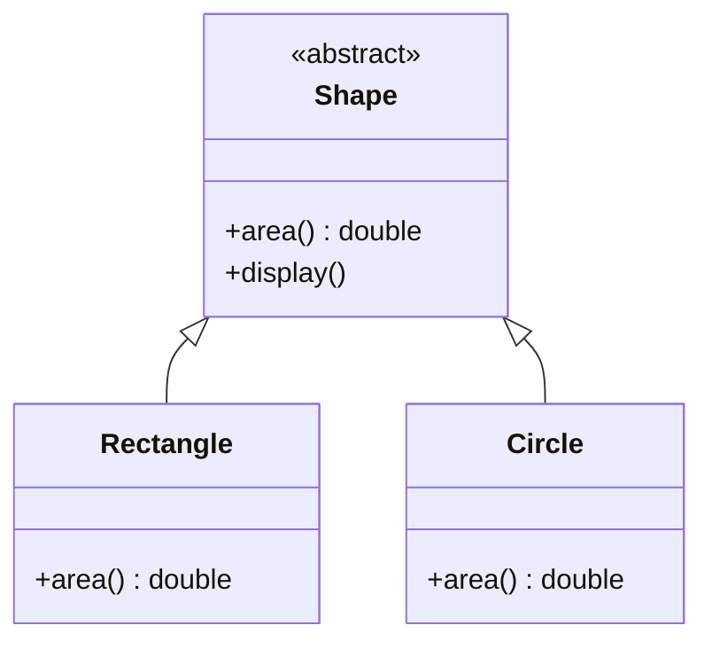

# Abstract Class in Java

Abstract classes in Java are essential for defining the structure and behavior of class hierarchies. They act as blueprints, allowing developers to specify common functionality while leaving some methods undefined for subclasses to implement. This approach leads to organized, scalable, and maintainable codebases.

---

## What is Abstraction in Java?

**Abstraction** is the process of hiding implementation details and exposing only the necessary features of an object. For example, when sending an SMS, you only interact with the interface (typing and sending the message), not the underlying delivery mechanism.

> **Abstraction lets you focus on what an object does, not how it does it.**

---

## Ways to Achieve Abstraction

There are two main ways to achieve abstraction in Java:

1. **Abstract Class** (0 to 100% abstraction)
2. **Interface** (100% abstraction)

---

## Abstract Class in Java

An **abstract class** is declared with the `abstract` keyword. It can have both abstract methods (without a body) and concrete methods (with a body). Abstract classes cannot be instantiated directly.

### Syntax

```java
public abstract class Shape {
    public abstract double area();
    public void display() {
        System.out.println("This is a shape.");
    }
}
```

---

## UML Diagram: Abstract Class Example



---

## Example: Abstract Method

```java
abstract void printStatus(); // no method body, abstract
```

---

## Example: Abstract Class with Abstract Method

```java
abstract class Bike {
    abstract void run();
}

class Honda extends Bike {
    void run() { System.out.println("running safely"); }
}

public class Main {
    public static void main(String args[]) {
        Bike obj = new Honda();
        obj.run();
    }
}
```
**Output:**
```
running safely
```

---

## Why Use Abstract Classes?

- **Code Reusability:** Common methods can be implemented once and inherited.
- **Defining a Common Interface:** Ensures consistency among related classes.
- **Enforcing Method Implementation:** Subclasses must implement abstract methods.

---

## Real-World Example

```java
abstract class Shape {
    abstract void draw();
}

class Rectangle extends Shape {
    void draw() { System.out.println("drawing rectangle"); }
}

class Circle extends Shape {
    void draw() { System.out.println("drawing circle"); }
}

public class Main {
    public static void main(String args[]) {
        Shape s = new Circle();
        s.draw();
    }
}
```
**Output:**
```
drawing circle
```

---

## Abstract Class with Constructor, Data Member, and Methods

```java
abstract class Bike {
    Bike() { System.out.println("bike is created"); }
    abstract void run();
    void changeGear() { System.out.println("gear changed"); }
}

class Honda extends Bike {
    void run() { System.out.println("running safely.."); }
}

public class Main {
    public static void main(String args[]) {
        Bike obj = new Honda();
        obj.run();
        obj.changeGear();
    }
}
```
**Output:**
```
bike is created
running safely..
gear changed
```

---

## Key Features of Abstract Classes

- Can have abstract and concrete methods
- Cannot be instantiated directly
- Can have constructors and static methods
- Can have final methods

---

## Best Practices

- Keep abstract classes focused and concise
- Use for related objects with shared behavior
- Prefer interfaces for multiple inheritance
- Provide meaningful abstract method names

---

## Conclusion

Abstract classes in Java provide a robust way to define class hierarchies, promote code reuse, and enforce consistency. By understanding and applying abstract classes appropriately, you can write cleaner, more maintainable Java applications.

