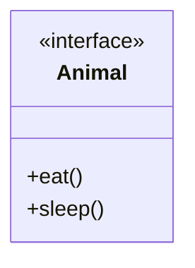

# Interface in Java

> **Note:**  
> Interfaces in Java are essential for abstraction, multiple inheritance, and loose coupling. They define contracts for classes, enabling modular and maintainable code.

---

## What is an Interface?

An **interface** in Java is a blueprint of a class. It contains static constants and abstract methods (method signatures without bodies). Interfaces enable abstraction and multiple inheritance in Java.

- **Cannot be instantiated** (like abstract classes)
- **All fields** are `public static final` by default
- **All methods** are `public abstract` by default (except static, default, and private methods since Java 8/9)
- **Supports IS-A relationship**

---

## Why Use Interfaces?

1. Achieve abstraction
2. Support multiple inheritance
3. Enable loose coupling

---

## Declaring an Interface

```java
interface Animal {
    void eat();
    void sleep();
}
```

**Diagram: Interface Declaration**



---

## How Interfaces Work

- The compiler adds `public abstract` to methods and `public static final` to fields.
- A class that implements an interface must implement all its methods.

---

## Example: Implementing an Interface

```java
interface Printable {
    void print();
}

class Printer implements Printable {
    public void print() {
        System.out.println("Hello");
    }
}

public class Main {
    public static void main(String args[]) {
        Printable p = new Printer();
        p.print();
    }
}
// Output: Hello
```

---

## Example: Multiple Implementations

```java
interface Drawable {
    void draw();
}

class Rectangle implements Drawable {
    public void draw() { System.out.println("drawing rectangle"); }
}

class Circle implements Drawable {
    public void draw() { System.out.println("drawing circle"); }
}

public class Main {
    public static void main(String args[]) {
        Drawable d = new Circle();
        d.draw();
    }
}
// Output: drawing circle
```

---

## Example: Interface for Polymorphism

```java
}    
class SBI implements Bank{    
  public float rateOfInterest(){return 9.15f;}    
}    
class PNB implements Bank{    
  public float rateOfInterest(){return 9.7f;}    
}    
class HDFC implements Bank{    
  public float rateOfInterest(){return 8.7f;}    
}    
  
public class Main{    
  public static void main(String[] args){    
    Bank b;  
    b=new SBI();    
    System.out.println("SBI ROI: "+b.rateOfInterest());   
    b=new PNB();    
    System.out.println("PNB ROI: "+b.rateOfInterest());   
    b=new HDFC();    
    System.out.println("HDFC ROI: "+b.rateOfInterest());   
  }  
}   
Output:

SBI ROI: 9.15
PNB ROI: 9.7
HDFC ROI: 8.7
Multiple Inheritance in Java by Interface
If a class implements multiple interfaces, or an interface extends multiple interfaces, it is known as multiple inheritance.

 multiple inheritance in java
Example
//Creating two interfaces  
interface Printable{    
  void print();    
}    
interface Showable{    
  void show();    
}    
//Creating a class that implements two interfaces  
class Computer implements Printable,Showable{    
  public void print(){System.out.println("printing data...");}    
  public void show(){System.out.println("showing data...");}    
}  
//Creating a Main class to create object and call methods  
public class Main{  
  public static void main(String args[]){    
    Computer c = new Computer();    
    c.print();    
    c.show();    
 }    
}    
Output:

printing data...
showing data...
Q) Multiple inheritance is not supported through classes in Java, but it is possible through an interface. Why?
As we have explained in the inheritance chapter, multiple inheritance is not supported in the case of a class because of ambiguity. However, it is supported in the case of an interface because there is no ambiguity. Because the implementation class provides its implementation. For example:

Example
interface Printable{    
void print();    
}    
interface Showable{    
void print();    
}    
    
public class Main implements Printable, Showable{    
public void print()  
{  
  System.out.println("Hello");  
  }    
public static void main(String args[]){    
Main obj = new Main();    
obj.print();    
 }    
}   
Output:

Hello
As we can see in the above example, the Printable and Showable interfaces have the same methods, but their implementation is provided by the Main class, so there is no ambiguity in the program.

Inheritance of Interfaces
A class implements an interface, but one interface can extend another interface.

Example
interface Printable{    
void print();    
}    
interface Showable extends Printable{    
void show();    
}    
class Main implements Showable{    
public void print(){System.out.println("Hello");}    
public void show(){System.out.println("Welcome");}    
    
public static void main(String args[]){    
Main obj = new Main();    
obj.print();    
obj.show();    
 }    
}    
Output:

Hello
Welcome
Interfaces and Polymorphism
One of the significant benefits of interfaces is their ability to support polymorphism. Since Java supports interface reference variables, we can use an interface type to refer to any object of a class that implements the interface. It enables flexibility and extensibility in your codebase.

Animal myAnimal = new Dog();  
myAnimal.eat();  
myAnimal.sleep();  
In this example, myAnimal is an interface reference variable of type Animal, referring to a Dog object. It demonstrates polymorphic behavior, where the method calls are resolved at runtime based on the actual object type.

Java 8 Default Method in Interface
Since Java 8, we can have method body in interface. But we need to make it default method. Let's see an example:

Example
interface Drawable{    
void draw();    
default void msg(){System.out.println("default method");}    
}    
class Rectangle implements Drawable{    
public void draw(){System.out.println("drawing rectangle");}    
}    
public class Main{    
public static void main(String args[]){    
Drawable d=new Rectangle();    
d.draw();    
d.msg();    
}  
}    
Output:

drawing rectangle
default method
Java 8 Static Method in Interface
Since Java 8, we can have static methods in the interface. Let's see an example:

Example
interface Drawable{    
void draw();    
static int cube(int x){return x*x*x;}    
}    
class Rectangle implements Drawable{    
public void draw(){System.out.println("drawing rectangle");}    
}    
    
class Main{    
public static void main(String args[]){    
Drawable d=new Rectangle();    
d.draw();    
System.out.println(Drawable.cube(3));    
}}    
Output:

drawing rectangle
27
Q) What is a marker or tagged interface?
An interface that has no members is known as a marker or tagged interface, for example, Serializable, Cloneable, Remote, etc. They are used to provide some essential information to the JVM so that the JVM may perform some useful operations.

To read more Marker Interface in Java

//How Serializable interface is written?  
public interface Serializable{  
}  
Nested Interface in Java
Note: An interface can have another interface, which is known as a nested interface. We will learn it in detail in the nested classes chapter. For example,
interface printable{  
 void print();  
 interface MessagePrintable{  
   void msg();  
 }  
}  
To read more https: Nested Interface

Best Practices
Follow the Single Responsibility Principle (SRP): Design interfaces with a clear and single purpose. Each interface should represent a cohesive set of behaviors.
Use Interfaces for Abstraction: Interfaces should focus on what needs to be done without concerning themselves with how it's done. It promotes abstraction and decouples the implementation from the interface.
Prefer Composition over Inheritance: Interfaces are a key component of achieving composition over inheritance, enabling flexible and modular designs.
Keep Interfaces Lean: Avoid bloating interfaces with unnecessary methods. Keep them concise and focused to make them easier to understand and implement.
Differences Between Abstract Class and Interface
Features
Abstract Class
Interface
Definition
A class that cannot be instantiated and may contain abstract and concrete methods.
A contract specifying methods that must be implemented by a class.
Usage
It is used when we need shared functionality among related classes.
It is used when we need to enforce a common protocol or contract across classes.
Declaration
The abstract keyword is used to declare an abstract class.
The interface keyword is used to declare an interface.
Keyword
An abstract class can be extended using the keyword "extends".
An interface can be implemented using the keyword "implements".
Methods
Abstract class can have abstract and non-abstract methods.
An interface can have only abstract methods. Since Java 8, it can have default and static methods also.
Inheritance
Abstract class does not support multiple inheritance.
Interface supports multiple inheritance.
Constructors
It can have constructors to initialize objects.
It does not have constructors because interfaces cannot be instantiated.
Fields and Variables
Abstract class can have final, non-final, static and non-static variables.
Interface has only static and final variables.
Implementation
An abstract class can provide the implementation of the interface.
The interface cannot provide the implementation of an abstract class.
Inheritance
An abstract class can extend another Java class and implement multiple Java interfaces.
An interface can extend another Java interface only.
Members
A Java abstract class can have class members like private, protected, etc.
Members of a Java interface are public by default.
Example
public abstract class Shape{
public abstract void draw();
}
public interface Drawable{
void draw();
}
Important Points to Remember
Interfaces provide abstraction: They define a contract without specifying implementation.
Interfaces support multiple inheritance: A class can implement multiple interfaces.
All fields in an interface are public, static, and final by default.
All methods in an interface are public and abstract by default (except default, static, and private methods).
Java 8 introduced default and static methods: Default methods provide implementation inside the interface, while static methods belong to the interface itself.
Java 9 introduced private methods in interfaces, which help in code reuse within the interface.
A class implementing an interface must implement all its methods, unless it is an abstract class.
Interfaces support polymorphism: An interface reference can hold objects of different implementing classes.
Marker interfaces (for example, Serializable, Cloneable) do not have methods but provide metadata to the JVM.
Interfaces can extend other interfaces: An interface can inherit from one or more interfaces.
Conclusion
Interfaces play a crucial role in Java programming, enabling the creation of modular, extensible, and maintainable codebases. By defining contracts for classes to adhere to, interfaces promote abstraction, polymorphism, and separation of concerns. Understanding how to use interfaces effectively empowers Java developers to write more flexible and scalable applications.